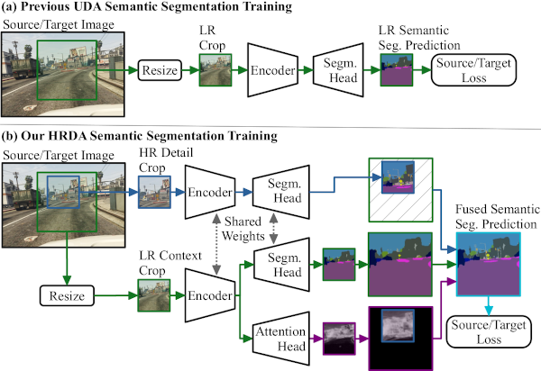
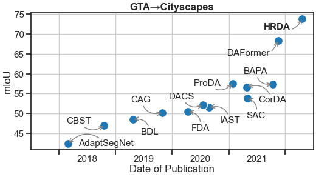
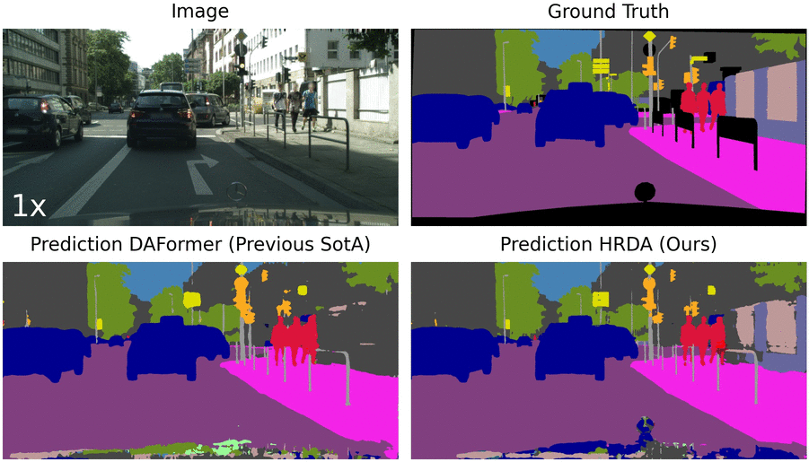

## HRDA: Context-Aware High-Resolution Domain-Adaptive Semantic Segmentation

**by [Lukas Hoyer](https://lhoyer.github.io/), [Dengxin Dai](https://vas.mpi-inf.mpg.de/dengxin/), and [Luc Van Gool](https://scholar.google.de/citations?user=TwMib_QAAAAJ&hl=en)**

**[[Arxiv]](https://arxiv.org/abs/2204.13132)**
**[[Paper]](https://arxiv.org/pdf/2204.13132)**

:bell: We are happy to announce that HRDA was accepted at **ECCV22**. :bell:

## Overview

**Unsupervised domain adaptation (UDA)** aims to adapt a model trained on
synthetic data to real-world data without requiring expensive annotations of
real-world images. As UDA methods for semantic segmentation are usually GPU
memory intensive, most **previous methods operate only on downscaled images**.
We question this design as low-resolution predictions often fail to preserve
fine details. The alternative of training with random crops of high-resolution
images alleviates this problem but falls short in capturing long-range,
domain-robust context information.

Therefore, we propose **HRDA**, a multi-resolution training approach for UDA,
that combines the strengths of small high-resolution crops to **preserve fine
segmentation details** and large low-resolution crops to **capture long-range
context dependencies** with a learned scale attention, while maintaining a
**manageable GPU memory** footprint.



HRDA enables adapting small objects and preserving fine segmentation details.
It significantly improves the state-of-the-art performance **by 5.5 mIoU for
GTA→Cityscapes** and **by 4.9 mIoU for Synthia→Cityscapes**, resulting in an
unprecedented performance of 73.8 and 65.8 mIoU, respectively.



The more detailed domain-adaptive semantic segmentation of HRDA, compared to
the previous state-of-the-art UDA method DAFormer, can also be observed in
example predictions from the Cityscapes validation set.



https://user-images.githubusercontent.com/1277888/181128057-27b8039f-a4c9-4f6d-9aa8-9b7f364d8921.mp4


For more information on HRDA, please check our
[[Paper]](https://arxiv.org/pdf/2204.13132).

If you find HRDA useful in your research, please consider citing:

```
@InProceedings{hoyer2022hrda,
  title={{HRDA}: Context-Aware High-Resolution Domain-Adaptive Semantic Segmentation},
  author={Hoyer, Lukas and Dai, Dengxin and Van Gool, Luc},
  booktitle={Proceedings of the European Conference on Computer Vision (ECCV)},
  year={2022}
}
```

## Setup Environment

For this project, we used python 3.8.5. We recommend setting up a new virtual
environment:

```shell
python -m venv ~/venv/hrda
source ~/venv/hrda/bin/activate
```

In that environment, the requirements can be installed with:

```shell
pip install -r requirements.txt -f https://download.pytorch.org/whl/torch_stable.html
pip install mmcv-full==1.3.7  # requires the other packages to be installed first
```

Further, please download the MiT weights from SegFormer using the
following script. If problems occur with the automatic download, please follow
the instructions for a manual download within the script.

```shell
sh tools/download_checkpoints.sh
```

## Setup Datasets

**Cityscapes:** Please, download leftImg8bit_trainvaltest.zip and
gt_trainvaltest.zip from [here](https://www.cityscapes-dataset.com/downloads/)
and extract them to `data/cityscapes`.

**GTA:** Please, download all image and label packages from
[here](https://download.visinf.tu-darmstadt.de/data/from_games/) and extract
them to `data/gta`.

**Synthia:** Please, download SYNTHIA-RAND-CITYSCAPES from
[here](http://synthia-dataset.net/downloads/) and extract it to `data/synthia`.

The final folder structure should look like this:

```none
DAFormer
├── ...
├── data
│   ├── cityscapes
│   │   ├── leftImg8bit
│   │   │   ├── train
│   │   │   ├── val
│   │   ├── gtFine
│   │   │   ├── train
│   │   │   ├── val
│   ├── gta
│   │   ├── images
│   │   ├── labels
│   ├── synthia
│   │   ├── RGB
│   │   ├── GT
│   │   │   ├── LABELS
├── ...
```

**Data Preprocessing:** Finally, please run the following scripts to convert the label IDs to the
train IDs and to generate the class index for RCS:

```shell
python tools/convert_datasets/gta.py data/gta --nproc 8
python tools/convert_datasets/cityscapes.py data/cityscapes --nproc 8
python tools/convert_datasets/synthia.py data/synthia/ --nproc 8
```

## Testing & Predictions

The provided HRDA checkpoint trained on GTA->Cityscapes
(already downloaded by `tools/download_checkpoints.sh`) can be tested on the
Cityscapes validation set using:

```shell
sh test.sh work_dirs/gtaHR2csHR_hrda_246ef
```

The predictions are saved for inspection to
`work_dirs/gtaHR2csHR_hrda_246ef/preds`
and the mIoU of the model is printed to the console. The provided checkpoint
should achieve 73.79 mIoU. Refer to the end of
`work_dirs/gtaHR2csHR_hrda_246ef/20220215_002056.log` for
more information such as the class-wise IoU.

If you want to visualize the LR predictions, HR predictions, or scale
attentions of HRDA on the validation set, please refer to [test.sh](test.sh) for
further instructions.

## Training

For convenience, we provide an [annotated config file](configs/hrda/gtaHR2csHR_hrda.py)
of the final HRDA. A training job can be launched using:

```shell
python run_experiments.py --config configs/hrda/gtaHR2csHR_hrda.py
```

The logs and checkpoints are stored in `work_dirs/`.

For the other experiments in our paper, we use a script to automatically
generate and train the configs:

```shell
python run_experiments.py --exp <ID>
```

More information about the available experiments and their assigned IDs, can be
found in [experiments.py](experiments.py). The generated configs will be stored
in `configs/generated/`.

When training a model on Synthia->Cityscapes, please note that the
evaluation script calculates the mIoU for all 19 Cityscapes classes. However,
Synthia contains only labels for 16 of these classes. Therefore, it is a common
practice in UDA to report the mIoU for Synthia->Cityscapes only on these 16
classes. As the Iou for the 3 missing classes is 0, you can do the conversion
`mIoU16 = mIoU19 * 19 / 16`.

## Framework Structure

This project is based on [mmsegmentation version 0.16.0](https://github.com/open-mmlab/mmsegmentation/tree/v0.16.0).
For more information about the framework structure and the config system,
please refer to the [mmsegmentation documentation](https://mmsegmentation.readthedocs.io/en/latest/index.html)
and the [mmcv documentation](https://mmcv.readthedocs.ihttps://arxiv.org/abs/2007.08702o/en/v1.3.7/index.html).

The most relevant files for HRDA are:

* [configs/hrda/gtaHR2csHR_hrda.py](configs/hrda/gtaHR2csHR_hrda.py):
  Annotated config file for the final HRDA.
* [mmseg/models/segmentors/hrda_encoder_decoder.py](mmseg/models/segmentors/hrda_encoder_decoder.py):
  Implementation of the HRDA multi-resolution encoding with context and detail crop.
* [mmseg/models/decode_heads/hrda_head.py](mmseg/models/decode_heads/hrda_head.py):
  Implementation of the HRDA decoding with multi-resolution fusion and scale attention.
* [mmseg/models/uda/dacs.py](mmseg/models/uda/dacs.py):
  Implementation of the DAFormer self-training.

## Acknowledgements

HRDA is based on the following open-source projects. We thank their
authors for making the source code publicly available.

* [DAFormer](https://github.com/lhoyer/DAFormer)
* [MMSegmentation](https://github.com/open-mmlab/mmsegmentation)
* [SegFormer](https://github.com/NVlabs/SegFormer)
* [DACS](https://github.com/vikolss/DACS)
